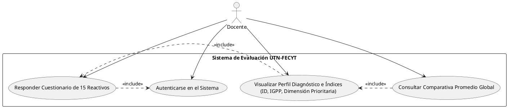
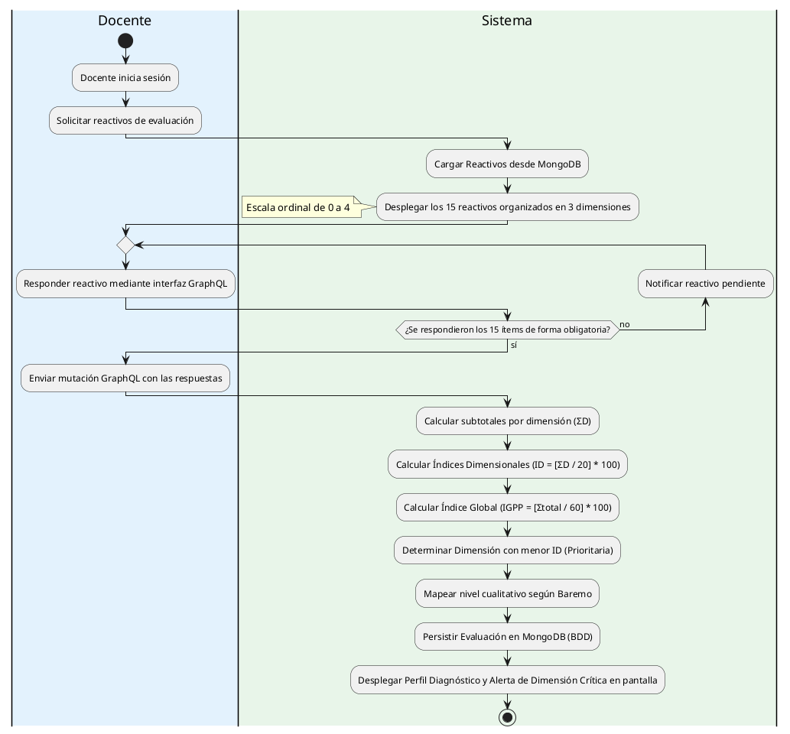
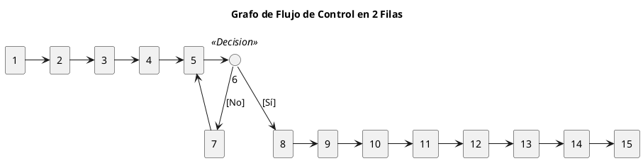

# V6.6.22 Inicialización del Proyecto
## Objetivos

- Definir los RQ del proyecto para definir la arquitectura del sistema.
- Crear los diagramas de caso de uso, procesos y grafo de pruebas para el sistema.
- Crear el repositorio del proyecto y subir los archivos iniciales.

## Roles y Casos de Uso

Cómo Administrador:
1. Inicio Sesión como Administrador.
2. CRUD de Preguntas y Dimensiones.
3. Ver Resultados de Evaluación.
4. Capacidad de conseguir informes completos con gráficos.

Cómo Docente:
1. Inicio Sesión como Docente.
2. Responder Preguntas del Instrumento de Evaluación.
3. Ver Resultados de Evaluación.
4. Capacidad de ver los resultados promedio global con respecto a la misma planificación.

## Requisitos del Proyecto
### Épica 1: Gestión del Instrumento y Parametrización (Administrador)
#### HU-01: CRUD de Dimensiones y Reactivos

**Como** Administrador del Sistema
**Quiero** gestionar (crear, leer, actualizar y eliminar) las dimensiones y las preguntas del instrumento 
**Para** mantener actualizado el banco de reactivos según las normativas del modelo didáctico.

**Criterios de Aceptación:**

**Escenario:** Creación exitosa de un reactivo.
* **Dado** que el administrador se encuentra en el módulo de configuración del instrumento.
* **Cuando** ingresa el enunciado de la pregunta, selecciona la dimensión a la que pertenece (D1, D2 o D3)  y guarda.
* **Entonces** el sistema almacena el reactivo y lo asigna dinámicamente al formulario con la escala ordinal de 0 a 4.

**Escenario:** Restricción de eliminación de reactivos con historial.
* **Dado** que un reactivo ya ha sido respondido en al menos una evaluación histórica.
* **Cuando** el administrador intenta eliminarlo.
* **Entonces** el sistema debe denegar la acción y sugerir la "desactivación" o archivado lógico para no corromper la integridad de los datos estadísticos pasados.

#### HU-02: Visualización y Reportes Globales del Administrador

**Como** Administrador del Sistema
**Quiero** visualizar un dashboard general y exportar informes con gráficos estadísticos de todas las evaluaciones
**Para** supervisar el nivel de pertinencia participativa a nivel institucional.

**Criterios de Aceptación:**

**Escenario:** Generación de gráficos de tendencias.
* **Dado** que el administrador accede al panel de reportes.
* **Entonces** el sistema debe mostrar gráficos (p. ej., de barras o radiales) con los promedios del Índice Global (IGPP) y los índices por dimensión (ID) acumulados de la facultad.

**Escenario:** Exportación de informes completos.
* **Dado** que el administrador requiere un respaldo físico o digital.
* **Cuando** presiona el botón "Exportar Informe".
* **Entonces** el sistema genera un archivo PDF estructurado con los datos descriptivos, las medias estadísticas y el desglose cualitativo según el baremo institucional.

### Épica 2: Registro y Proceso de Evaluación (Docente)
#### HU-03: Ejecución del Formulario de Evaluación Cuantitativa

**Como** Docente
**Quiero** responder los 15 ítems del instrumento utilizando la escala Likert de presencia 
**Para** registrar de manera honesta y reflexiva el grado de participación infantil contemplado en mi planificación.

**Criterios de Aceptación:**

**Escenario:** Guardado completo del instrumento.
* **Dado** que el docente está respondiendo el cuestionario distribuido en las 3 dimensiones.
* **Cuando** selecciona un valor obligatorio entre 0 y 4 para cada uno de los 15 reactivos y presiona "Finalizar".
* **Entonces** el sistema calcula internamente las fórmulas estadísticas ($\Sigma D$, $ID$, $IGPP$)  y almacena el estado de la evaluación como "Concluida".

### Épica 3: Analítica y Diagnóstico (Docente)
#### HU-04: Visualización del Perfil Diagnóstico Individual

**Como** Docente
**Quiero** visualizar inmediatamente los resultados cuantitativos y cualitativos detallados de mi evaluación
**Para** identificar con precisión el componente más débil que requiere mejoras focalizadas.

**Criterios de Aceptación:**

**Escenario:** Despliegue automatizado del diagnóstico.
* **Dado** que el docente finalizó su evaluación.
* **Entonces** el sistema debe mostrar en pantalla:
    * El puntaje y el porcentaje ($ID$) obtenido en cada dimensión.
    * El Índice Global de Pertinencia Participativa ($IGPP$).
    * El nivel alcanzado de acuerdo al baremo (p. ej., "Participación en desarrollo").

**Escenario:** Alerta de Dimensión Prioritaria de Mejora.
* **Dado** el cálculo de los tres índices ($ID$).
* **Entonces** el sistema debe resaltar visualmente en color contrastante la dimensión que obtuvo el menor porcentaje, etiquetándola explícitamente como "Dimensión prioritaria de mejora".

## Base de Datos

Base de Datos: MongoDB. Se escogió una BDD NoSQL por la flexibilidad que esta nos ofrece, más ahora qué el proyecto se encuentra en una etapa de desarrollo inicial y es probable que se requieran cambios en la estructura de los datos a medida que se avanza en el desarrollo.

Colección: Administradores

```json
{
    "_id": ObjectId("..."),
    "nombre": "Juan Pérez",
    "email": "juan.perez@example.com",
    "password": "hashed_password",
    "version": "V6.6.22"
}
```

Colección: Dimensiones

```json
{
    "_id": ObjectId("..."),
    "orden": 1, // Orden de la dimensión (1, 2 o 3)
    "nombre": "Dimensión 1",
    "descripcion": "Descripción de la dimensión 1",
    "fundamento": "Fundamento teórico de la dimensión 1",
    "reactivos": [{
        "reactivo_codigo": "1.1", // Referencia al reactivo
        "enunciado": "Enunciado del reactivo",
        "pista": "Pista o aclaración del reactivo",
        },
        ...
    ],
    "version": "V6.6.22"
}
```

Colección: Evaluaciones

```json
{
    "_id": ObjectId("..."),
    "datos_docente": {
        "cedula": "1234567890",
        "nombre": "María López",
    },
    "respuestas": [
        {
            "reactivo_codigo": "1.1", // Referencia al reactivo respondido
            "valor": 3 // Valor seleccionado en la escala Likert (0-4)
        },
        ...
    ],
    "resultados": {
        "subtotales": { "D1": 16, "D2": 12, "D3": 9 },
        "indices_dimensionales": { "ID1": 80.0, "ID2": 60.0, "ID3": 45.0 },
        "IGPP": 61.7,
        "dimension_prioritaria": "D3"
    },
    "version": "V6.6.22"
}
```

Para el índice $IGPP$ se puede calcular dinámicamente a partir de las respuestas almacenadas en la colección de Respuestas, sumando los valores de cada dimensión y aplicando la fórmula correspondiente.

## Arquitectura del Sistema

El sistema se desarrollará usando la arquitectura hexagonal (también conocida como arquitectura de puertos y adaptadores) para garantizar una separación clara entre la lógica de negocio y las interfaces externas. Esto facilitará la mantenibilidad y escalabilidad del proyecto a medida que evoluciona. Además de ayudar para el desarrollo de pruebas unitarias e integración, ya que los adaptadores pueden ser fácilmente simulados o reemplazados por implementaciones de prueba.
Dicho de este modo, quedará organizado de la siguiente manera:

```yaml
src/
├── domain/
│   ├── models/ # Entidades del dominio (Usuario, Dimensión, Respuesta)
│   |   ├── *.model # Define la estructura de los datos y las reglas de negocio básicas.
│   ├── repositories/
│   |   └── *.repository.port # Define las operaciones que se necesita
│   └── services/
│       └── calculos.service # Lógica de negocio, como el cálculo de índices y validaciones.
├── application/
│   ├── use_cases/ # Casos de uso que orquestan la lógica de negocio (e.g., CrearUsuario, ResponderEvaluacion)
└── infrastructure/
    └── adapters/
        ├── graphql/
        │   ├── schemas/
        │   |   └── *.graphql # Define los tipos para GraphQL, como Usuario, Dimensión, Respuesta, etc.
        │   ├── resolvers/
        │   |   └── *.resolver # Mapea las peticiones de GraphQL a los casos de uso de la aplicación.
        │   └── server/
        │       └── server # Configuración del servidor GraphQL
        └── database/
            └── mongodb/
                ├── models/
                │   └──  *.schema # Define los esquemas de Mongoose para las colecciones de MongoDB.
                ├── repositories/
                │    └── *.repository # Implementación de los repositorios para MongoDB.
                └── migrations/
                    └── model/ # nombre del modelo
                        ├── v1_to_v2.migration.js # Contiene la función pura de transformación
                        └── index.js # Orquestación de la migración
                        
```

Con esta estructura, solo quedaría en la misma carpeta el tipo de prueba a realizar. 

## Diagramas

Por el momento solo se toma el caso de uso central, donde el docente responde las preguntas. Se podría agregar otros casos, donde por ejemplo el administrador pueda crear preguntas, ver resultados, etc. Pero por el momento se toma el caso de uso central.

### Diagrama de Casos de Uso



### Diagrama de Procesos



### Diagrama de Grafo de Pruebas



### Cálculos de Complejidad Ciclomática $V(G)$

Para este grafo tenemos las siguientes métricas base:

* **Número de Nodos ($n$):** 15
* **Número de Aristas ($a$):** 15
* **Número de Nodos Predicado / Decisiones ($p$):** 1 (El nodo 6).
* **Regiones ($r$):** 1 (El espacio cerrado por el bucle 5-6-7).

#### 1. Por Aristas y Nodos

$V(G) = a - n + 2$
$$V(G) = 15 - 15 + 2$$
$$V(G) = 0 + 2 = 2$$

#### 2. Por Regiones

$$ V(G) = r + 1 $$
$$ V(G) = 1 + 1 $$
$$ V(G) = 2 $$

#### 3. Por Condiciones / Nodos Predicado

$$v(G) = c + 1$$
$$V(G) = 1 + 1$$
$$V(G) = 2$$

## Walktrough

### 2026-06-24
- **7:58:** He inicializado el proyecto, creado el repositorio y subido los archivos iniciales.

#### Explicación Técnica

Se implementó la estructura base completa del backend siguiendo la arquitectura hexagonal definida en los requisitos.

**Stack tecnológico:**
- **Runtime:** Node.js con TypeScript (strict mode)
- **API GraphQL:** Apollo Server v4 + Express v4
- **Base de Datos:** MongoDB con Mongoose v9
- **Autenticación:** JWT (jsonwebtoken + bcryptjs)
- **Utilidades:** dotenv, cors, @graphql-tools/schema

**Estructura implementada (22 archivos de código fuente):**

| Capa | Archivos | Descripción |
|------|----------|-------------|
| **Dominio** | `administrador.model.ts`, `dimension.model.ts`, `evaluacion.model.ts` | Interfaces y DTOs del negocio |
| **Dominio** | `*.repository.port.ts` (3) | Contratos de acceso a datos (puertos) |
| **Dominio** | `calculos.service.ts` | Lógica pura: ΣD, ID, IGPP, baremo cualitativo |
| **Infra - GraphQL** | `*.graphql` (3) | Schemas: tipos, inputs, queries y mutations |
| **Infra - GraphQL** | `*.resolver.ts` (3) | Resolvers que conectan GraphQL → Casos de uso |
| **Infra - GraphQL** | `server.ts`, `jwt.middleware.ts` | Servidor Apollo + middleware de autenticación |
| **Infra - DB** | `*.schema.ts` (3) | Modelos Mongoose con validaciones |
| **Infra - DB** | `*.repository.ts` (3) | Implementación de repositorios MongoDB |
| **Infra - DB** | `connection.ts` | Conexión a MongoDB |
| **Entrada** | `index.ts` | Punto de entrada con health check |

**Endpoints disponibles:**
- `POST /graphql` — Interfaz GraphQL (Playground en desarrollo)
- `GET /health` — Health check del servidor

**Mutaciones GraphQL implementadas:**
- `login(input)` → Retorna token JWT
- `crearAdministrador(input)` → Registro con hash bcrypt
- `crearDimension(input)` → CRUD de dimensiones
- `actualizarDimension(id, input)` → Actualización parcial
- `eliminarDimension(id)` → Con validación de historial (HU-01)
- `agregarReactivo(dimensionId, input)` → Agregar reactivos a dimensión
- `crearEvaluacion(input)` → Recibe 15 respuestas, calcula ΣD/ID/IGPP automáticamente

**Queries GraphQL implementadas:**
- `obtenerDimensiones`, `obtenerDimension(id)`, `obtenerDimensionPorOrden(orden)`
- `obtenerEvaluaciones`, `obtenerEvaluacion(id)`, `obtenerEvaluacionesPorDocente(cedula)`
- `obtenerPromediosGlobales` → Promedios institucionales (HU-02)

**Fórmulas de cálculo implementadas en `calculos.service.ts`:**
```
ΣD = Σ(valores por dimensión)        [5 reactivos × 4 = 20 max]
ID = (ΣD / 20) × 100                 [Índice Dimensional]
IGPP = (Σtotal / 60) × 100           [Índice Global de Pertinencia Participativa]
```

**Baremo cualitativo:**
| IGPP | Nivel |
|------|-------|
| ≥ 90 | Participación protagónica |
| ≥ 70 | Participación en desarrollo |
| ≥ 50 | Participación en consulta |
| ≥ 30 | Participación marginal |
| < 30 | Sin participación |

**Compilación verificada:** TypeScript compila sin errores (`tsc --noEmit` exitoso).

**Comandos disponibles:**
```bash
npm run dev      # Servidor en desarrollo (ts-node)
npm run build    # Compilar a JavaScript
npm start        # Ejecutar versión compilada
```

