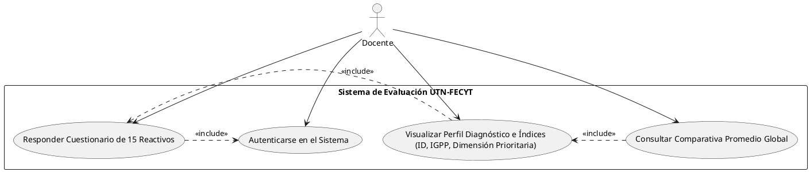
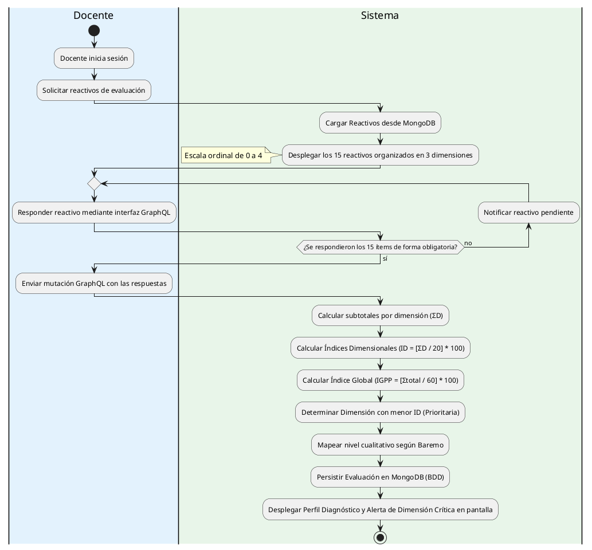
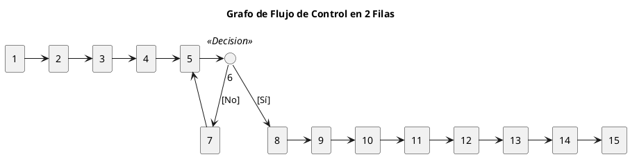

# V6.6.25 Ampliación de Documentación
## Objetivos 

- Agregar documentación a los requisitos de la [versión 6.6.22](V6.6.22%20Inicialización%20del%20Proyecto.md), debido a que en el día 6.6.24 agregamos un requisito, el cual no está tomado en cuenta. 
- Desarrollar las tablas de casos de pruebas correspondientes a los [diagramas de la versión 6.6.22](V6.6.22%20Inicialización%20del%20Proyecto.md##Diagramas), para poder desarrollar las respectivas pruebas para Backend
- Desarrollar el framework de pruebas de cobertura para autoexportar los resultados en un reporte en html. De acuerdo a eso poder realizar las pruebas unitarias, de integración, e2e y otros.

## Roles y Casos de Uso
Cómo Administrador:
1. Inicio Sesión como Administrador.
2. CRUD de Preguntas y Dimensiones.
3. CRUD de más Administradores.
4. Ver Resultados de Evaluación.
5. Capacidad de conseguir informes completos con gráficos.

Cómo Docente:
1. Inicio Sesión como Docente.
2. Responder Preguntas del Instrumento de Evaluación.
3. Ver Resultados de Evaluación.
4. Capacidad de ver los resultados promedio global con respecto a la misma planificación.

### Épica 1: Gestión del Instrumento y Parametrización (Administrador)
#### HU-01: CRUD de Dimensiones y Reactivos

**Como** Administrador del Sistema
**Quiero** gestionar (crear, leer, actualizar y eliminar) las dimensiones y las preguntas del instrumento 
**Para** mantener actualizado el banco de reactivos según las normativas del modelo didáctico.

**Criterios de Aceptación:**

**Escenario:** Creación exitosa de un reactivo.
* **Dado** que el administrador se encuentra en el módulo de configuración del instrumento.
* **Cuando** ingresa el enunciado de la pregunta, selecciona la dimensión a la que pertenece (D1, D2 o D3)  y guarda.
* **Entonces** el sistema almacena el reactivo y lo asigna dinámicamente al formulario con la escala ordinal de 0 a 4.

**Escenario:** Restricción de eliminación de reactivos con historial.
* **Dado** que un reactivo ya ha sido respondido en al menos una evaluación histórica.
* **Cuando** el administrador intenta eliminarlo.
* **Entonces** el sistema debe denegar la acción y sugerir la "desactivación" o archivado lógico para no corromper la integridad de los datos estadísticos pasados.

#### HU-02: CRUD de Administradores del Sistema

**Como** Administrador del Sistema
**Quiero** gestionar (crear, leer, actualizar y cambiar el estado de) las cuentas de otros administradores
**Para** delegar o restringir el acceso al control de la plataforma y garantizar la seguridad de la información.
**Criterios de Aceptación:**

**Escenario:** Creación exitosa de un nuevo administrador.
* **Dado** que el administrador se encuentra en el módulo de "Gestión de Usuarios / Administradores".
* **Cuando** ingresa los datos obligatorios (Nombre completo, Correo institucional, Rol y Contraseña) y presiona "Guardar".
* **Entonces** el sistema valida que el correo no esté duplicado, registra al nuevo usuario, y le envía una notificación por correo electrónico con sus credenciales de acceso.

**Escenario:** Restricción de eliminación de cuentas de administrador (Eliminación lógica).
* **Dado** que un administrador no puede ser eliminado permanentemente para no perder la trazabilidad de auditoría (por ejemplo, quién creó un reactivo).
* **Cuando** el administrador principal intenta "Eliminar" una cuenta de administrador activa.
* **Entonces** el sistema cambia su estado a "Inactivo" (desactivación lógica), bloqueando inmediatamente su inicio de sesión pero preservando su historial en la base de datos.

**Escenario:** Modificación de perfil de administrador.
* **Dado** que el administrador está visualizando la lista de administradores del sistema.
* **Cuando** selecciona un usuario, edita sus campos (ej. actualizar correo o restablecer contraseña) y confirma los cambios.
* **Entonces** el sistema actualiza la información en tiempo real y registra la fecha de la última modificación.

**Escenario:** Restricción de auto-eliminación o auto-desactivación.
* **Dado** que el administrador ha iniciado sesión con su propia cuenta.
* **Cuando** intenta desactivar o cambiar el estado de su propio usuario en la lista.
* **Entonces** el sistema bloquea la acción, mostrando un mensaje de error: *"No puedes desactivar o eliminar tu propia cuenta en sesión"*, para evitar que el sistema se quede sin administradores activos.

#### HU-03: Visualización y Reportes Globales del Administrador

**Como** Administrador del Sistema
**Quiero** visualizar un dashboard general y exportar informes con gráficos estadísticos de todas las evaluaciones
**Para** supervisar el nivel de pertinencia participativa a nivel institucional.

**Criterios de Aceptación:**

**Escenario:** Generación de gráficos de tendencias.
* **Dado** que el administrador accede al panel de reportes.
* **Entonces** el sistema debe mostrar gráficos (p. ej., de barras o radiales) con los promedios del Índice Global (IGPP) y los índices por dimensión (ID) acumulados de la facultad.

**Escenario:** Exportación de informes completos.
* **Dado** que el administrador requiere un respaldo físico o digital.
* **Cuando** presiona el botón "Exportar Informe".
* **Entonces** el sistema genera un archivo PDF estructurado con los datos descriptivos, las medias estadísticas y el desglose cualitativo según el baremo institucional.

### Épica 2: Registro y Proceso de Evaluación (Docente)
#### HU-04: Ejecución del Formulario de Evaluación Cuantitativa

**Como** Docente
**Quiero** responder los 15 ítems del instrumento utilizando la escala Likert de presencia 
**Para** registrar de manera honesta y reflexiva el grado de participación infantil contemplado en mi planificación.

**Criterios de Aceptación:**

**Escenario:** Guardado completo del instrumento.
* **Dado** que el docente está respondiendo el cuestionario distribuido en las 3 dimensiones.
* **Cuando** selecciona un valor obligatorio entre 0 y 4 para cada uno de los 15 reactivos y presiona "Finalizar".
* **Entonces** el sistema calcula internamente las fórmulas estadísticas ($\Sigma D$, $ID$, $IGPP$)  y almacena el estado de la evaluación como "Concluida".

### Épica 3: Analítica y Diagnóstico (Docente)
#### HU-05: Visualización del Perfil Diagnóstico Individual

**Como** Docente
**Quiero** visualizar inmediatamente los resultados cuantitativos y cualitativos detallados de mi evaluación
**Para** identificar con precisión el componente más débil que requiere mejoras focalizadas.

**Criterios de Aceptación:**

**Escenario:** Despliegue automatizado del diagnóstico.
* **Dado** que el docente finalizó su evaluación.
* **Entonces** el sistema debe mostrar en pantalla:
    * El puntaje y el porcentaje ($ID$) obtenido en cada dimensión.
    * El Índice Global de Pertinencia Participativa ($IGPP$).
    * El nivel alcanzado de acuerdo al baremo (p. ej., "Participación en desarrollo").

**Escenario:** Alerta de Dimensión Prioritaria de Mejora.
* **Dado** el cálculo de los tres índices ($ID$).
* **Entonces** el sistema debe resaltar visualmente en color contrastante la dimensión que obtuvo el menor porcentaje, etiquetándola explícitamente como "Dimensión prioritaria de mejora".

## Diagramas

Por el momento solo se toma el caso de uso central, donde el docente responde las preguntas. Se podría agregar otros casos, donde por ejemplo el administrador pueda crear preguntas, ver resultados, etc. Pero por el momento se toma el caso de uso central.

### Diagrama de Casos de Uso



### Diagrama de Procesos



### Diagrama de Grafo de Pruebas



### Cálculos de Complejidad Ciclomática $V(G)$

Para este grafo tenemos las siguientes métricas base:

* **Número de Nodos ($n$):** 15
* **Número de Aristas ($a$):** 15
* **Número de Nodos Predicado / Decisiones ($p$):** 1 (El nodo 6).
* **Regiones ($r$):** 1 (El espacio cerrado por el bucle 5-6-7).

#### 1. Por Aristas y Nodos

$V(G) = a - n + 2$
$$V(G) = 15 - 15 + 2$$
$$V(G) = 0 + 2 = 2$$

#### 2. Por Regiones

$$ V(G) = r + 1 $$
$$ V(G) = 1 + 1 $$
$$ V(G) = 2 $$

#### 3. Por Condiciones / Nodos Predicado

$$v(G) = c + 1$$
$$V(G) = 1 + 1$$
$$V(G) = 2$$

## Tablas de Casos de Prueba
### Tabla de Condiciones de Entrada
| ID CP | Escenario | Número de Reactivos Respondidos | Resultado Esperado |
|-------|-----------|---------------------------------|--------------------|
| CP-01 | Responder todos los reactivos correctamente | V | Evaluación Concluida, Cálculo de ID y IGPP correcto |
| CP-02 | Algún reactivo no respondido o valor diferente a 15 | NV | Evaluación Incompleta, Error de Validación |

### Tabla de Clases de Equivalencia
| Sec. | Condición de Entrada | Tipo | Entrada Válida | Código | Entrada No Válida | Código |
|------|----------------------|------|----------------|--------|-------------------|--------|
| 1 | Responder todos los reactivos correctamente | Valor | Respuestas == 15 | CEV-01 | Algún reactivo no respondido o valor diferente a 15 | CENV-01 |

### Tabla de Casos de Prueba
| ID CP | Clases de Equivalencia | Número de Reactivos Respondidos | Resultado Esperado | 
|-------|------------------------|---------------------------------|--------------------|
| CP-01 | CEV-01 | 15 | Evaluación Concluida, Cálculo de ID y IGPP correcto |
| CP-02 | CENV-01 | < 15 | Evaluación Incompleta, Error de Validación |

## Framework de Pruebas - Implementación

### Dependencias Instaladas

| Paquete | Propósito |
|---|---|
| `vitest` | Framework de pruebas unitarias, integración y E2E |
| `@vitest/coverage-v8` | Motor de cobertura V8 para generación de reportes HTML |
| `mongodb-memory-server` | Instancia MongoDB en memoria para pruebas de integración |

### Estructura de Archivos

```
Backend/
├── .env.test.example          # Template de variables de entorno de prueba
├── .env.test                  # Variables reales (gitignored)
├── tests/
│   ├── vitest.config.ts       # Configuración de Vitest + cobertura HTML
│   ├── setup.ts               # Setup global: mongodb-memory-server
│   └── coverage/              # Output de reportes HTML (generado por vitest)
└── src/
    └── infrastructure/adapters/graphql/resolvers/
        └── evaluacion.resolver.test.ts  # Tests co-located junto al resolver
```

### Configuración

#### `.env.test` - Variables de Entorno de Prueba

```env
NODE_ENV=test
PORT=4001
JWT_SECRET=test_secret_key_para_pruebas_2026
JWT_EXPIRES_IN=1h
```

> **Nota:** `MONGODB_URI` se genera dinámicamente por `mongodb-memory-server` en `tests/setup.ts` y no requiere configuración manual.

#### `tests/vitest.config.ts` - Configuración de Vitest

- **Modo:** `node` (sin navegador)
- **Hooks:** `setupFiles` ejecuta `tests/setup.ts` antes de cada archivo de prueba
- **Timeout:** 30s para tests, 60s para hooks (necesario para MongoDB in-memory)
- **Cobertura:** Motor V8, reportes HTML + text, directorio `tests/coverage/`
- **Patrón de inclusión:** `src/**/*.test.ts` (tests co-located)

#### `tests/setup.ts` - MongoDB en Memoria

El setup global gestiona el ciclo de vida de MongoDB para cada archivo de prueba:

1. **`beforeAll`**: Levanta `MongoMemoryServer`, asigna `MONGODB_URI` a `process.env`, conecta Mongoose
2. **`afterAll`**: Desconecta Mongoose, detiene el servidor en memoria
3. **`afterEach`**: Limpia todas las colecciones entre tests para aislamiento

### Scripts Disponibles

| Comando | Descripción |
|---|---|
| `npm test` | Vitest en watch mode (re-ejecuta al detectar cambios) |
| `npm run test:run` | Ejecución única de todos los tests |
| `npm run test:coverage` | Ejecuta tests + genera reporte de cobertura HTML en `tests/coverage/` |

### Pruebas Implementadas

#### CP-01: Evaluación con 15 Respuestas Válidas

**Tipo:** Integración (GraphQL + MongoDB in-memory)

**Archivo:** `src/infrastructure/adapters/graphql/resolvers/evaluacion.resolver.test.ts`

**Setup:**
- Seed de 3 dimensiones con 5 reactivos cada una (códigos `1.1` a `15.1`)
- Apollo Server creado in-memory con `executeOperation` (sin HTTP)

**Escenario:**
- Se envía la mutación `crearEvaluacion` con 15 respuestas (valor: 3 cada una)
- Se verifica que la evaluación se crea correctamente
- Se validan los cálculos: subtotales (D1=15, D2=15, D3=15), IGPP=75, dimensión prioritaria

**Resultado:** ✅ PASSED

#### CP-02: Evaluación con Menos de 15 Respuestas

**Tipo:** Integración (validación de negocio)

**Escenario:**
- Se envía la mutación `crearEvaluacion` con solo 10 respuestas
- Se espera error de validación: `"Se deben responder exactamente 15 reactivos"`
- Se verifica que no se crea ninguna evaluación en la base de datos

**Resultado:** ✅ PASSED

### Reporte de Cobertura

Al ejecutar `npm run test:coverage`, se genera un reporte HTML interactivo en `tests/coverage/index.html` con el desglose por archivo:

| Capa | Archivo | % Stmts | % Branch | % Funcs | % Lines |
|---|---|---|---|---|---|
| Domain/Services | `calculos.service.ts` | 71.11% | 56.66% | 100% | 75.75% |
| Infrastructure/Resolvers | `evaluacion.resolver.ts` | 64.28% | 83.33% | 33.33% | 61.53% |
| MongoDB/Schemas | `*.schema.ts` | 100% | 100% | 100% | 100% |
| MongoDB/Repositories | `evaluacion.repository.ts` | 33.33% | 14.28% | 27.27% | 44.44% |

> La cobertura será incremental a medida que se agreguen más pruebas para las demás HU (HU-01 a HU-05).

### Convenciones

- **Naming:** Archivos de prueba siguen el patrón `*.test.ts` y se colocan al lado del archivo fuente correspondiente (co-located)
- **Base de datos:** Todas las pruebas usan `mongodb-memory-server` (nunca apuntan a una BD real)
- **GraphQL:** Pruebas de integración usan `server.executeOperation` de Apollo Server (sin levantar HTTP)
- **Variables de entorno:** Configuradas en `.env.test` (gitignored), template en `.env.test.example`

## Walktrough
### 2026-06-25

**Actividad:** Desarrollo del framework de pruebas con Vitest

**Entregables:**
1. Framework de pruebas configurado con Vitest + cobertura V8 HTML
2. MongoDB en memoria (`mongodb-memory-server`) para pruebas de integración sin dependencia de BD externa
3. Variables de entorno de prueba separadas (`.env.test` / `.env.test.example`)
4. Pruebas CP-01 y CP-02 implementadas y ejecutadas exitosamente para HU-04
5. Scripts `test`, `test:run` y `test:coverage` agregados al `package.json`
6. Documentación actualizada en este archivo

**Decisiones técnicas:**
- Se usa `server.executeOperation` de Apollo Server para pruebas GraphQL (sin levantar HTTP)
- Tests co-located (al lado del archivo fuente) para mantenimiento cercano
- Cobertura HTML exportada en `tests/coverage/` para revisión visual
- `hookTimeout: 60000ms` necesario para la primera descarga de MongoDB binario (~780MB)

**Cobertura lograda:** 28.69% global (promedio entre todas las capas del proyecto)
