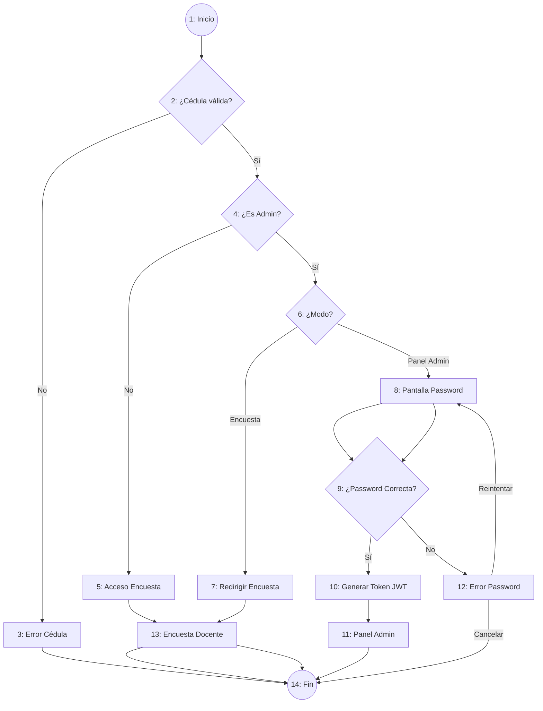

# Diseño de Casos de Prueba - Módulo de Login y Autenticación

**Proyecto:** Sistema de Evaluación Docente  
**Módulo:** Login y Autenticación (Frontend / Sistema)  
**Metodología:** Gestión de Pruebas de Software - Pruebas de Caja Negra y Análisis del Camino Básico (Complejidad Ciclomática)  
**Referencia Documental:** *03 Gestión de Pruebas de Software - Diseño de Casos de Pruebas (MSc. Cathy Guevara)*

---

## 1. Grafo de Nodos y Cálculo de Complejidad Ciclomática \(V(G)\)

### 1.1 Grafo de Nodos del Proceso de Autenticación
El siguiente grafo representa la estructura de control de flujo del diagrama de procesos del módulo de Login y Autenticación:

### 1.2 Descripción de los Nodos del Grafo
- **Nodo 1:** Inicio / Ingreso de Cédula de Identidad.
- **Nodo 2 ($P_1$):** Predicado: ¿La cédula ingresada tiene formato válido ($\ge 3$ dígitos)?
- **Nodo 3:** Despliegue de mensaje de error por cédula inválida (*SnackBar*).
- **Nodo 4 ($P_2$):** Predicado: ¿La cédula corresponde a un usuario Administrador?
- **Nodo 5:** Permitir acceso directo a la encuesta docente (Docente Regular).
- **Nodo 6 ($P_3$):** Predicado: ¿Qué opción selecciona el Administrador en el modal (*Encuesta* o *Panel Admin*)?
- **Nodo 7:** Redirigir a la encuesta docente desde la sesión de Administrador.
- **Nodo 8:** Desplegar formulario de ingreso de contraseña de Administrador.
- **Nodo 9 ($P_4$):** Predicado: ¿La contraseña de Administrador ingresada es correcta?
- **Nodo 10:** Autenticar usuario, almacenar Token JWT en el cliente.
- **Nodo 11:** Acceder al Panel de Control de Administración (`/admin-panel`).
- **Nodo 12:** Mostrar mensaje de error por contraseña incorrecta.
- **Nodo 13:** Acceder a la Portada de la Encuesta Docente (`/portada`).
- **Nodo 14:** Fin del proceso.

---

### 1.3 Cálculo de la Complejidad Ciclomática \(V(G)\)
Siguiendo las tres fórmulas planteadas en la teoría del documento:

1. **Método por Nodos Predicados ($P$):**
   $$V(G) = P + 1$$
   - Nodos predicados (decisiones): $P_1$ (Nodo 2), $P_2$ (Nodo 4), $P_3$ (Nodo 6), $P_4$ (Nodo 9).
   - Total de nodos predicados $P = 4$.
   $$\mathbf{V(G) = 4 + 1 = 5}$$

2. **Método por Áreas o Regiones Cerradas ($R$):**
   $$V(G) = R + 1$$
   - Número de regiones cerradas en el grafo $R = 4$.
   $$\mathbf{V(G) = 4 + 1 = 5}$$

3. **Método por Aristas ($A$) y Nodos ($N$):**
   $$V(G) = A - N + 2$$
   - Aristas $A = 17$, Nodos $N = 14$.
   $$\mathbf{V(G) = 17 - 14 + 2 = 5}$$

---

### 1.4 Caminos Independientes (Escenarios de Prueba)
Dado que $V(G) = 5$, existen **5 caminos independientes mínimos** a probar:

- **Camino 1 (Escenario 1):** $1 \rightarrow 2 \rightarrow 3 \rightarrow 14$  
  *(Cédula vacía o inválida $\rightarrow$ Mensaje de error)*
- **Camino 2 (Escenario 2):** $1 \rightarrow 2 \rightarrow 4 \rightarrow 5 \rightarrow 13 \rightarrow 14$  
  *(Docente Regular ingresa cédula válida $\rightarrow$ Acceso a Encuesta)*
- **Camino 3 (Escenario 3):** $1 \rightarrow 2 \rightarrow 4 \rightarrow 6 \rightarrow 7 \rightarrow 13 \rightarrow 14$  
  *(Admin ingresa cédula $\rightarrow$ Elige "Responder Encuesta" $\rightarrow$ Acceso a Encuesta)*
- **Camino 4 (Escenario 4):** $1 \rightarrow 2 \rightarrow 4 \rightarrow 6 \rightarrow 8 \rightarrow 9 \rightarrow 12 \rightarrow 14$  
  *(Admin ingresa cédula $\rightarrow$ Elige "Panel Admin" $\rightarrow$ Ingresa contraseña incorrecta $\rightarrow$ Cancela)*
- **Camino 5 (Escenario 5):** $1 \rightarrow 2 \rightarrow 4 \rightarrow 6 \rightarrow 8 \rightarrow 9 \rightarrow 10 \rightarrow 11 \rightarrow 14$  
  *(Admin ingresa cédula $\rightarrow$ Elige "Panel Admin" $\rightarrow$ Ingresa contraseña correcta $\rightarrow$ Token JWT y acceso a Panel Admin)*

---

## 2. Tabla 1: Condiciones de Entrada (Estados por Escenario)

A continuación se determinan los estados de las condiciones de entrada: **Válida (V)**, **No Válida (NV)** o **No Aplica (N/A)** para cada resultado esperado.

| ID CP | Escenario | Cédula de Identidad | Rol de Usuario | Modo Seleccionado | Contraseña Admin | Resultado Esperado |
| :---: | :---: | :---: | :---: | :---: | :---: | :--- |
| **CP1** | Escenario 1 | **NV** | N/A | N/A | N/A | Mensaje de error: *"Ingrese una cédula válida"* en SnackBar. |
| **CP2** | Escenario 2 | **V** | **V** (*regular*) | N/A | N/A | Redirección inmediata a la Encuesta Docente (`/portada`). |
| **CP3** | Escenario 3 | **V** | **V** (*admin*) | **V** (*Encuesta*) | N/A | Redirección a la Encuesta Docente (`/portada`) tras confirmar modal. |
| **CP4** | Escenario 4 | **V** | **V** (*admin*) | **V** (*Panel Admin*) | **NV** (*incorrecta/vacía*) | Mensaje de error: *"Contraseña incorrecta"*, permanencia en pantalla. |
| **CP5** | Escenario 5 | **V** | **V** (*admin*) | **V** (*Panel Admin*) | **V** (*correcta*) | Autenticación exitosa, almacenamiento de Token JWT y redirección a `/admin-panel`. |

---

## 3. Tabla 2: Clases de Equivalencia

Partición de las condiciones de entrada en clases de equivalencia válidas y no válidas con sus respectivos códigos de identificación.

| Sec. | Condición de Entrada | Tipo | Clases Válidas (Entrada) | Código Válido | Clases No Válidas (Entrada) | Código No Válido |
| :---: | :--- | :--- | :--- | :---: | :--- | :---: |
| **1** | **Cédula de Identidad** | Rango / Valor | Cadena numérica de $\ge 3$ dígitos válidos | **CEV<01>** | - Cadena vacía o menor a 3 dígitos - Contiene letras o caracteres especiales | **CENV<01>** **CENV<02>** |
| **2** | **Rol de Usuario** | Miembro de un conjunto | - Usuario Docente Regular (`regular`) - Usuario Administrador (`admin`) | **CEV<02>** **CEV<03>** | Cédula no registrada o falla de conexión GraphQL | **CENV<03>** |
| **3** | **Modo Seleccionado** | Miembro de un conjunto | - Opción "Responder Encuesta" - Opción "Panel Admin" | **CEV<04>** **CEV<05>** | Opción no seleccionada o modal cerrado | **CENV<04>** |
| **4** | **Contraseña Admin** | Valor | Cadena de contraseña correcta de Administrador | **CEV<06>** | - Contraseña vacía - Contraseña incorrecta / no coincide | **CENV<05>** **CENV<06>** |

---

## 4. Tabla 3: Casos de Prueba

Diseño detallado de los casos de prueba asociando las clases de equivalencia con los datos de entrada específicos y el resultado esperado del sistema.

| ID CP | Clases de Equivalencia Cubiertas | Cédula de Identidad | Rol de Usuario | Modo Seleccionado | Contraseña Admin | Resultado Esperado |
| :---: | :--- | :---: | :---: | :---: | :---: | :--- |
| **CP1** | `CENV<01>`, `CENV<02>` | `"12"` | N/A | N/A | N/A | Se muestra SnackBar flotante rojo con el mensaje *"Ingrese una cédula válida"*. |
| **CP2** | `CEV<01>`, `CEV<02>` | `"1002345678"` | `regular` | N/A | N/A | Transición de pantalla a `/portada` pasando la cédula como argumento. |
| **CP3** | `CEV<01>`, `CEV<03>`, `CEV<04>` | `"1712345678"` | `admin` | `"Encuesta"` | N/A | Despliega modal `AvisoRolDialog`. Al presionar "Responder Encuesta", redirige a `/portada`. |
| **CP4** | `CEV<01>`, `CEV<03>`, `CEV<05>`, `CENV<06>` | `"1712345678"` | `admin` | `"Panel Admin"` | `"claveIncorrecta123"` | Se muestra SnackBar *"Contraseña incorrecta. Inténtelo de nuevo"*. Se mantiene la pantalla de login de admin. |
| **CP5** | `CEV<01>`, `CEV<03>`, `CEV<05>`, `CEV<06>` | `"1712345678"` | `admin` | `"Panel Admin"` | `"admin2026*"` | Petición de mutación `login` exitosa. Se registra el Token JWT en `GraphQLService` y redirige a `/admin-panel`. |
