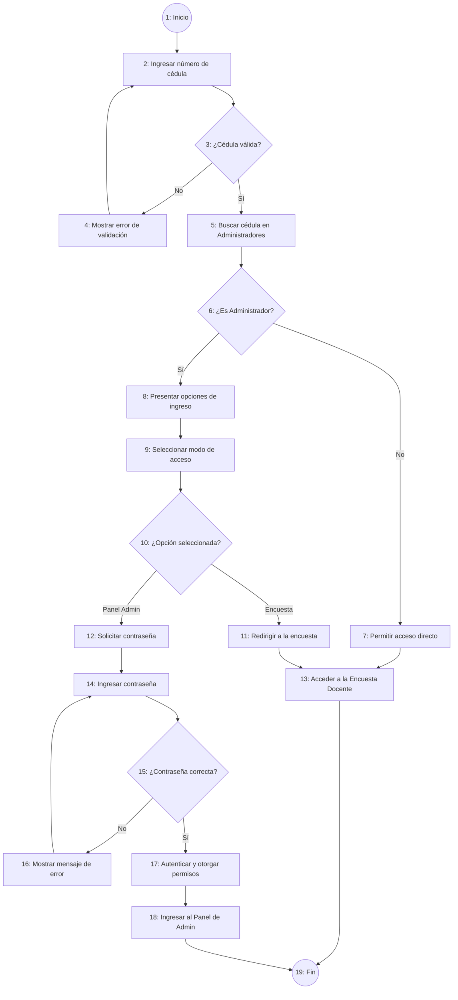

# Diseño de Casos de Prueba - Módulo de Login y Autenticación

**Proyecto:** Sistema de Evaluación Docente  
**Módulo:** Login y Autenticación (Frontend / Sistema)  
**Metodología:** Gestión de Pruebas de Software - Pruebas de Caja Negra y Análisis del Camino Básico (Complejidad Ciclomática)  
**Referencia Documental:** *03 Gestión de Pruebas de Software - Diseño de Casos de Pruebas (MSc. Cathy Guevara)*

---

## 1. Grafo de Nodos y Cálculo de Complejidad Ciclomática \(V(G)\)

### 1.1 Grafo de Nodos del Proceso de Autenticación
El siguiente grafo representa la estructura de control de flujo del diagrama de procesos del módulo de Login y Autenticación, reflejando los bucles mediante retroalimentaciones directas (`backward`):

### 1.2 Descripción de los Nodos del Grafo
- **Nodo 1:** Inicio del proceso.
- **Nodo 2:** Ingresar número de cédula (Usuario).
- **Nodo 3 ($P_1$):** Predicado: ¿Cédula válida? (Verificación mediante algoritmo de cédula ecuatoriana).
- **Nodo 4:** Mostrar error de validación de cédula (Sistema - bucle hacia Nodo 2).
- **Nodo 5:** Buscar cédula en colección de Administradores (Sistema).
- **Nodo 6 ($P_2$):** Predicado: ¿Es Administrador?
- **Nodo 7:** Permitir acceso directo a la encuesta docente (Docente Regular).
- **Nodo 8:** Presentar opciones de ingreso - Encuesta / Panel Admin (Sistema).
- **Nodo 9:** Seleccionar modo de acceso (Usuario).
- **Nodo 10 ($P_3$):** Predicado: ¿Opción seleccionada?
- **Nodo 11:** Redirigir a la encuesta docente (Sistema).
- **Nodo 12:** Solicitar contraseña de administrador (Sistema).
- **Nodo 13:** Acceder a la Encuesta Docente (Usuario).
- **Nodo 14:** Ingresar contraseña (Usuario).
- **Nodo 15 ($P_4$):** Predicado: ¿Contraseña correcta?
- **Nodo 16:** Mostrar mensaje de error (Sistema - bucle hacia Nodo 14).
- **Nodo 17:** Autenticar y otorgar permisos de administrador (Generar Token JWT).
- **Nodo 18:** Ingresar al Panel de Administración (Usuario).
- **Nodo 19:** Fin del proceso.

---

### 1.3 Cálculo de la Complejidad Ciclomática \(V(G)\)
Siguiendo las tres fórmulas planteadas en la teoría del documento:

1. **Método por Nodos Predicados ($P$):**
   $$V(G) = P + 1$$
   - Nodos predicados (decisiones): $P_1$ (Nodo 3), $P_2$ (Nodo 6), $P_3$ (Nodo 10), $P_4$ (Nodo 15).
   - Total de nodos predicados $P = 4$.
   $$\mathbf{V(G) = 4 + 1 = 5}$$

2. **Método por Áreas o Regiones Cerradas ($R$):**
   $$V(G) = R + 1$$
   - Región 1: Bucle `2 -> 3 -> 4 -> 2`.
   - Región 2: Bucle `14 -> 15 -> 16 -> 14`.
   - Región 3: Región cerrada entre la ruta de Docente Regular y la ruta de Administrador que va a Encuesta.
   - Región 4: Región cerrada formada por los caminos de salida hacia el nodo Fin (Nodo 19).
   - Total de regiones cerradas $R = 4$.
   $$\mathbf{V(G) = 4 + 1 = 5}$$

3. **Método por Aristas ($A$) y Nodos ($N$):**
   $$V(G) = A - N + 2$$
   - Aristas $A = 22$, Nodos $N = 19$.
   $$\mathbf{V(G) = 22 - 19 + 2 = 5}$$

---

### 1.4 Caminos Independientes (Escenarios de Prueba)
Dado que $V(G) = 5$, existen **5 caminos independientes mínimos** a probar:

- **Camino 1 (Escenario 1):** $1 \rightarrow 2 \rightarrow 3 \xrightarrow{\text{no}} 4 \rightarrow 2$  
  *(Cédula inválida $\rightarrow$ Mensaje de error y bucle de reintento)*
- **Camino 2 (Escenario 2):** $1 \rightarrow 2 \rightarrow 3 \xrightarrow{\text{sí}} 5 \rightarrow 6 \xrightarrow{\text{no}} 7 \rightarrow 13 \rightarrow 19$  
  *(Docente Regular ingresa cédula válida $\rightarrow$ Acceso a Encuesta)*
- **Camino 3 (Escenario 3):** $1 \rightarrow 2 \rightarrow 3 \xrightarrow{\text{sí}} 5 \rightarrow 6 \xrightarrow{\text{sí}} 8 \rightarrow 9 \rightarrow 10 \xrightarrow{\text{Encuesta}} 11 \rightarrow 13 \rightarrow 19$  
  *(Admin ingresa cédula $\rightarrow$ Elige "Encuesta" $\rightarrow$ Acceso a Encuesta)*
- **Camino 4 (Escenario 4):** $1 \rightarrow 2 \rightarrow 3 \xrightarrow{\text{sí}} 5 \rightarrow 6 \xrightarrow{\text{sí}} 8 \rightarrow 9 \rightarrow 10 \xrightarrow{\text{Panel Admin}} 12 \rightarrow 14 \rightarrow 15 \xrightarrow{\text{no}} 16 \rightarrow 14$  
  *(Admin ingresa cédula $\rightarrow$ Elige "Panel Admin" $\rightarrow$ Contraseña incorrecta $\rightarrow$ Mensaje de error y bucle de reintento)*
- **Camino 5 (Escenario 5):** $1 \rightarrow 2 \rightarrow 3 \xrightarrow{\text{sí}} 5 \rightarrow 6 \xrightarrow{\text{sí}} 8 \rightarrow 9 \rightarrow 10 \xrightarrow{\text{Panel Admin}} 12 \rightarrow 14 \rightarrow 15 \xrightarrow{\text{sí}} 17 \rightarrow 18 \rightarrow 19$  
  *(Admin ingresa cédula $\rightarrow$ Elige "Panel Admin" $\rightarrow$ Contraseña correcta $\rightarrow$ Acceso al Panel Admin)*

---

## 2. Tabla 1: Condiciones de Entrada (Estados por Escenario)

A continuación se determinan los estados de las condiciones de entrada: **Válida (V)**, **No Válida (NV)** o **No Aplica (N/A)** para cada resultado esperado de acuerdo a los caminos.

| ID CP | Escenario | Cédula de Identidad | Rol de Usuario | Modo Seleccionado | Contraseña Admin | Resultado Esperado |
| :---: | :---: | :---: | :---: | :---: | :---: | :--- |
| **CP1** | Escenario 1 | **NV** | N/A | N/A | N/A | Mensaje de error de validación de cédula y bucle de reintento. |
| **CP2** | Escenario 2 | **V** | **V** (*regular*) | N/A | N/A | Redirección inmediata a la Encuesta Docente (`/portada`). |
| **CP3** | Escenario 3 | **V** | **V** (*admin*) | **V** (*Encuesta*) | N/A | Redirección a la Encuesta Docente (`/portada`). |
| **CP4** | Escenario 4 | **V** | **V** (*admin*) | **V** (*Panel Admin*) | **NV** (*incorrecta*) | Mensaje de error de contraseña y bucle de reintento. |
| **CP5** | Escenario 5 | **V** | **V** (*admin*) | **V** (*Panel Admin*) | **V** (*correcta*) | Autenticación exitosa y redirección a `/admin-panel`. |

---

## 3. Tabla 2: Clases de Equivalencia

Partición de las condiciones de entrada en clases de equivalencia válidas y no válidas con sus respectivos códigos de identificación, alineado con las validaciones de cédula y contraseñas.

| Sec. | Condición de Entrada | Tipo | Clases Válidas (Entrada) | Código Válido | Clases No Válidas (Entrada) | Código No Válido |
| :---: | :--- | :--- | :--- | :---: | :--- | :---: |
| **1** | **Cédula de Identidad** | Rango / Valor / Algoritmo | Cédula de 10 dígitos que cumple provincia (01-24) y dígito verificador (módulo 10). | **CEV<01>** | - Longitud diferente de 10 dígitos. - Contiene caracteres no numéricos. - Provincia fuera del rango 01-24. - Dígito verificador incorrecto. | **CENV<01>** **CENV<02>** **CENV<03>** **CENV<04>** |
| **2** | **Rol de Usuario** | Miembro de un conjunto | - Usuario Docente Regular (`regular`). - Usuario Administrador (`admin`). | **CEV<02>** **CEV<03>** | Cédula no registrada (falla de verificación en el sistema). | **CENV<05>** |
| **3** | **Modo Seleccionado** | Miembro de un conjunto | - Opción "Responder Encuesta". - Opción "Panel Admin". | **CEV<04>** **CEV<05>** | Opción no seleccionada o modal cerrado. | **CENV<06>** |
| **4** | **Contraseña Admin** | Valor | Contraseña correcta del administrador. | **CEV<06>** | - Contraseña vacía. - Contraseña incorrecta. | **CENV<07>** **CENV<08>** |

---

## 4. Tabla 3: Casos de Prueba

Diseño detallado de los casos de prueba asociando las clases de equivalencia con los datos de entrada específicos y el resultado esperado del sistema.

| ID CP | Clases de Equivalencia Cubiertas | Cédula de Identidad | Rol de Usuario | Modo Seleccionado | Contraseña Admin | Resultado Esperado |
| :---: | :--- | :---: | :---: | :---: | :---: | :--- |
| **CP1** | `CENV<01>`, `CENV<02>` | `"17180564"` | N/A | N/A | N/A | Mensaje de error *"Cédula ecuatoriana inválida"* en SnackBar y retorno al campo de cédula. |
| **CP1b** | `CENV<04>` | `"1718056491"` | N/A | N/A | N/A | Mensaje de error *"Cédula ecuatoriana inválida"* (falla de dígito verificador) y retorno al campo de cédula. |
| **CP2** | `CEV<01>`, `CEV<02>` | `"1002003000"` (regular) | `regular` | N/A | N/A | Redirección exitosa a `/portada`. |
| **CP3** | `CEV<01>`, `CEV<03>`, `CEV<04>` | `"1718056490"` (admin) | `admin` | `"Encuesta"` | N/A | Cierre de modal y redirección a `/portada`. |
| **CP4** | `CEV<01>`, `CEV<03>`, `CEV<05>`, `CENV<08>` | `"1718056490"` (admin) | `admin` | `"Panel Admin"` | `"passwordErroneo12"` | Mensaje de error *"Contraseña incorrecta. Inténtelo de nuevo"* y retorno al campo de contraseña. |
| **CP5** | `CEV<01>`, `CEV<03>`, `CEV<05>`, `CEV<06>` | `"1718056490"` (admin) | `admin` | `"Panel Admin"` | `"admin2026*"` | Petición exitosa, almacenamiento de Token JWT y redirección a `/admin-panel`. |
